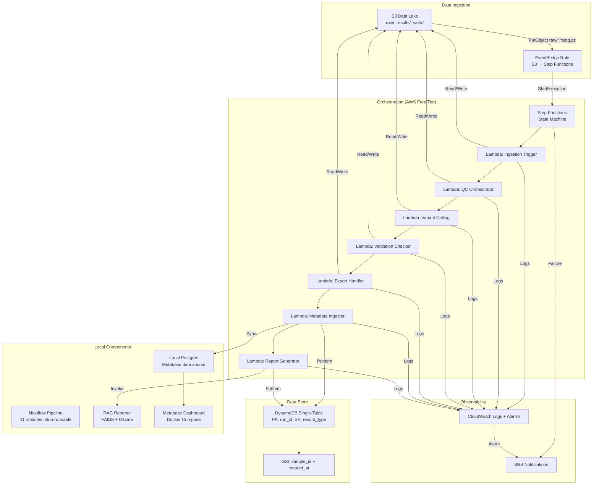
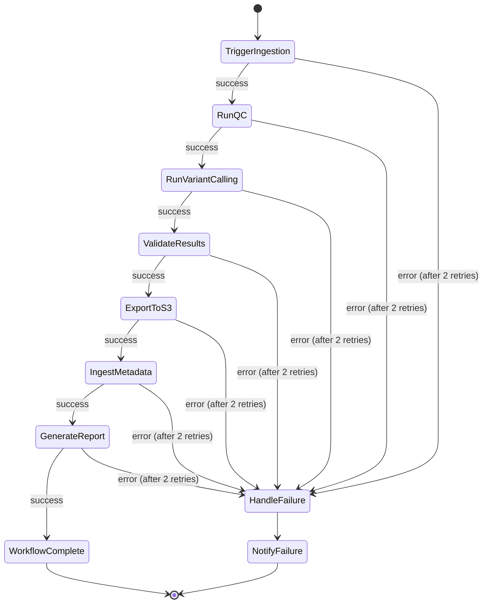
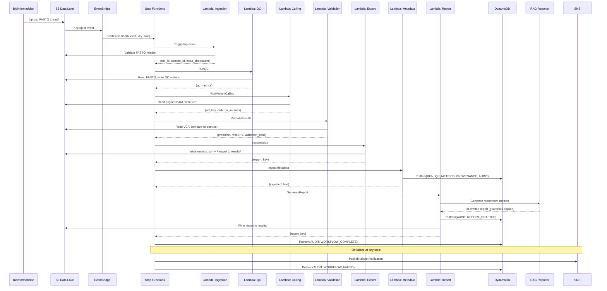
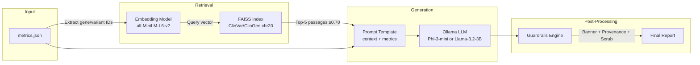
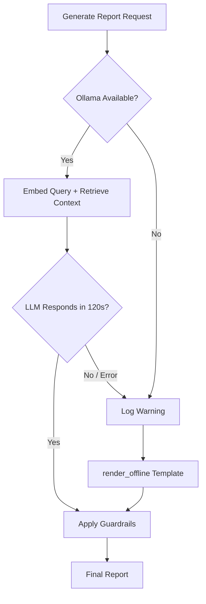

# Design Document — Clinical Genomics Insight Platform

## Overview

This design describes the evolution of the Clinical Genomics Insight Platform from its current scaffolded state (AWS Batch/Fargate compute, Postgres data store) to a fully serverless, free-tier-compliant architecture using Lambda + Step Functions orchestration, DynamoDB single-table design, EventBridge-driven automation, and a local RAG-augmented AI reporting pipeline.

The design preserves all existing pipeline modules (Nextflow DSL2, 11 processes), the insert-only data integrity model, and the AI guardrails engine while replacing cost-prohibitive infrastructure (Batch, Fargate, NAT Gateway) with always-free-tier equivalents.

### Key Design Goals

- **Zero idle cost**: All AWS resources use on-demand/serverless pricing within always-free-tier limits
- **ISO 15189 traceability patterns**: Append-only records, provenance stamps, immutable audit trail
- **Local-first AI**: RAG + QLoRA fine-tuning on local/free compute, no paid cloud AI services
- **Production migration path**: Each component maps cleanly to a production-grade AWS service

## Architecture

### High-Level Architecture



### CDK Stack Restructuring

The existing 4 stacks are restructured into 5 stacks:

| Current Stack | Action | New Stack(s) |
|---|---|---|
| `data-lake-stack.ts` | EVOLVE | `data-lake-stack.ts` (add EventBridge notifications) |
| `compute-stack.ts` | REPLACE | `orchestration-stack.ts` (Step Functions + Lambda + EventBridge) |
| `iam-stack.ts` | REPLACE | `iam-stack.ts` (per-Lambda roles, deny policies) |
| `observability-stack.ts` | EVOLVE | `observability-stack.ts` (Lambda/SFN metrics) |
| — | NEW | `metadata-stack.ts` (DynamoDB table, GSI, PITR) |

### Step Functions State Machine



**Retry Configuration (all states):**
- MaxAttempts: 2
- IntervalSeconds: 5
- BackoffRate: 2.0
- Non-retryable errors: `States.ALL` after retries exhausted → `HandleFailure`

**Concurrency Control:**
- `maxConcurrency: 1` on the state machine to stay within 4,000 monthly state transitions (free tier)

### Sequence Diagram — End-to-End Flow



## Components and Interfaces

### 1. Data Lake Stack (`data-lake-stack.ts`) — EVOLVED

**Changes from current:** Add EventBridge notification configuration for S3 object creation events.

```typescript
// Additions to existing DataLakeStack:
// - Enable EventBridge notifications on the bucket
this.bucket.enableEventBridgeNotification(); // required for EventBridge to receive S3 events
```

All existing configuration (versioning, encryption, lifecycle, object lock, block public access) is preserved unchanged.

### 2. Orchestration Stack (`orchestration-stack.ts`) — NEW (replaces compute-stack)

**Responsibility:** Step Functions state machine, 7 Lambda functions, EventBridge rule, SNS topic, DLQ.

```typescript
interface OrchestrationStackProps extends cdk.StackProps {
  dataLakeBucket: s3.IBucket;
  metadataTable: dynamodb.ITable;
  lambdaRoles: Record<string, iam.IRole>; // per-function roles from IAM stack
}
```

**Lambda Functions:**

| Function | Memory | Timeout | Triggers | Writes To |
|---|---|---|---|---|
| `cgp-ingestion-trigger` | 256 MB | 60s | SFN state | S3 (validate), DDB (audit) |
| `cgp-qc-orchestrator` | 512 MB | 15 min | SFN state | S3 (QC output) |
| `cgp-variant-calling` | 512 MB | 15 min | SFN state | S3 (VCF output) |
| `cgp-validation-checker` | 512 MB | 5 min | SFN state | S3 (validation output) |
| `cgp-export-handler` | 256 MB | 5 min | SFN state | S3 (results/) |
| `cgp-metadata-ingestor` | 256 MB | 60s | SFN state | DDB (all record types) |
| `cgp-report-generator` | 512 MB | 2 min | SFN state | S3, DDB (audit) |

**EventBridge Rule:**
```json
{
  "source": ["aws.s3"],
  "detail-type": ["Object Created"],
  "detail": {
    "bucket": { "name": ["<data-lake-bucket-name>"] },
    "object": {
      "key": [{ "prefix": "raw/" }, { "suffix": ".fastq.gz" }]
    }
  }
}
```

Note: EventBridge content filtering supports prefix + suffix but not case-insensitive matching natively. The ingestion Lambda performs case-insensitive validation and short-circuits if the extension doesn't match after normalization.

**Dead-Letter Queue:** SQS queue with 14-day message retention for failed EventBridge deliveries.

### 3. Metadata Stack (`metadata-stack.ts`) — NEW

**Responsibility:** DynamoDB table definition, GSI, PITR configuration.

```typescript
interface MetadataStackProps extends cdk.StackProps {}
// Exports: metadataTable (ITable)
```

### 4. IAM Stack (`iam-stack.ts`) — REPLACED

**Changes:** Remove Batch job/execution roles. Create 7 per-Lambda roles with scoped permissions + explicit deny policies.

Each role grants only:
- The specific S3 prefixes that function needs
- The specific DynamoDB actions that function needs
- CloudWatch Logs `CreateLogStream` + `PutLogEvents`
- Step Functions `SendTaskSuccess` / `SendTaskFailure` (where applicable)

All roles carry explicit deny statements for:
- `dynamodb:DeleteItem`, `dynamodb:UpdateItem`, `dynamodb:DeleteTable`
- `s3:DeleteObject`, `s3:DeleteObjectVersion` on `raw/*` and `results/*`

### 5. Observability Stack (`observability-stack.ts`) — EVOLVED

**Changes:** Replace Batch metrics with Lambda/Step Functions metrics.

**Alarms defined:**
- `ExecutionsFailed >= 1` in 1-minute period
- Lambda error rate > 5% over 5 minutes (minimum 10 invocations)
- `ExecutionTime > 1800000ms` (30 minutes)
- DLQ `ApproximateNumberOfMessagesVisible >= 1`
- Billing `EstimatedCharges > $1`

All alarms publish to a shared SNS topic.

### 6. RAG Reporter Architecture



**Components:**
- **Vector Store**: FAISS index over ClinVar/ClinGen annotations for chr20 genes (~50-100 entries for HG002 target region)
- **Embedding Model**: `sentence-transformers/all-MiniLM-L6-v2` (22M params, CPU-friendly, 384-dim embeddings)
- **LLM**: Ollama serving `phi3:mini` (3.8B) or `llama3.2:3b` — both fit in 4GB RAM with 4-bit quantization
- **Retrieval Flow**:
  1. Parse `metrics.json` → extract variant/gene identifiers from called variants
  2. Embed query text (gene name + variant context) using sentence-transformers
  3. Search FAISS index → retrieve top-5 passages with cosine similarity ≥ 0.70
  4. Construct prompt: system instructions + retrieved passages + structured metrics
  5. Generate via Ollama → enforce word count [120, 300]
  6. Apply `enforce_guardrails()` → banner, provenance, clinical-phrase scrubbing
- **Fallback**: If Ollama fails (timeout 120s, OOM, missing model), fall back to existing deterministic `render_offline()` template

### 7. Metabase + DynamoDB Bridge

**Decision: Option B — Local Postgres fed by the same Lambda ingestor for dashboard purposes.**

**Rationale:**
- Metabase has native Postgres support (no custom drivers needed)
- The existing Postgres schema + views (`v_run_summary`) already serve dashboard queries efficiently
- DynamoDB is the AWS-deployed source of truth; local Postgres is the dashboard read replica
- The `cgp-metadata-ingestor` Lambda writes to DynamoDB (cloud truth) AND the local sync mechanism writes to Postgres (dashboard)
- For local development: docker-compose Postgres is populated by the same data path
- For production: DynamoDB Streams → Lambda → Aurora Serverless (or the existing Postgres via VPN)

**Sync mechanism:**
- In local/demo mode: The `cgp-metadata-ingestor` Lambda (or its local equivalent script) writes directly to both DynamoDB and Postgres
- Dashboard freshness target: < 5 minutes from DynamoDB write to Metabase visibility

### 8. Nextflow Pipeline (Unchanged Architecture)

The existing 11-module pipeline architecture is preserved. The Lambda orchestrators invoke Nextflow stages locally (for demo) or coordinate with containerized execution. The pipeline itself remains:

```
read_trimming (fastp) → read_qc (FastQC) → alignment (BWA-MEM2) →
mark_duplicates (MarkDuplicates) → variant_calling (HaplotypeCaller|DeepVariant) →
validation (hap.py) → structured_export (JSON+Parquet) → multiqc_report (MultiQC)
```

Each process retains its `container` directive and `stub:` block for offline validation.

## Data Models

### DynamoDB Single-Table Design

**Table:** `cgp-metadata`
- **Billing:** PAY_PER_REQUEST (on-demand, always-free tier)
- **PK:** `run_id` (String) — e.g., `run_20240115_HG002_chr20_001`
- **SK:** `record_type` (String) — one of: `RUN`, `QC_METRICS`, `PROVENANCE`, `AUDIT`, `CORRECTION`
- **GSI:** `sample_id-created_at-index` (PK: `sample_id`, SK: `created_at`)
- **PITR:** Enabled
- **Removal Policy:** RETAIN

#### Example Items

**RUN record:**
```json
{
  "run_id": "run_20240115_HG002_chr20_001",
  "record_type": "RUN",
  "sample_id": "HG002",
  "pipeline_version": "0.3.0",
  "git_commit": "a1b2c3d4e5f6a1b2c3d4e5f6a1b2c3d4e5f6a1b2",
  "caller": "HaplotypeCaller",
  "started_at": "2024-01-15T09:00:00Z",
  "exported_at": "2024-01-15T09:25:00Z",
  "validation_pass": true,
  "created_at": "2024-01-15T09:25:30Z"
}
```

**QC_METRICS record:**
```json
{
  "run_id": "run_20240115_HG002_chr20_001",
  "record_type": "QC_METRICS",
  "sample_id": "HG002",
  "percent_duplication": 0.0523,
  "snp_precision": 0.9985,
  "snp_recall": 0.9972,
  "snp_f1": 0.9978,
  "n_variants": 84312,
  "created_at": "2024-01-15T09:25:30Z"
}
```

**PROVENANCE record:**
```json
{
  "run_id": "run_20240115_HG002_chr20_001",
  "record_type": "PROVENANCE",
  "sample_id": "HG002",
  "input_checksums": {
    "HG002_chr20_R1.fastq.gz": "sha256:e3b0c44298fc1c149afbf4c8996fb92427ae41e4649b934ca495991b7852b855",
    "HG002_chr20_R2.fastq.gz": "sha256:d7a8fbb307d7809469ca9abcb0082e4f8d5651e46d3cdb762d02d0bf37c9e592"
  },
  "pipeline_version": "0.3.0",
  "caller_tool": "HaplotypeCaller",
  "caller_version": "4.5.0.0",
  "reference_build": "GRCh38",
  "reference_version": "hg38",
  "truth_set_version": "GIAB_v4.2.1_HG002_chr20",
  "created_at": "2024-01-15T09:25:30Z"
}
```

**AUDIT record:**
```json
{
  "run_id": "run_20240115_HG002_chr20_001",
  "record_type": "AUDIT",
  "sample_id": "HG002",
  "action": "WORKFLOW_COMPLETE",
  "detail": null,
  "execution_start": "2024-01-15T09:00:00Z",
  "execution_end": "2024-01-15T09:25:30Z",
  "created_at": "2024-01-15T09:25:30Z"
}
```

**CORRECTION record:**
```json
{
  "run_id": "run_20240115_HG002_chr20_001",
  "record_type": "CORRECTION",
  "sample_id": "HG002",
  "original_record_type": "QC_METRICS",
  "correction_reason": "Recalculated duplication after removing optical duplicates",
  "percent_duplication": 0.0498,
  "created_at": "2024-01-16T10:00:00Z"
}
```

### S3 Data Lake Prefix Structure

```
s3://cgp-data-lake/
├── raw/                          # Immutable inputs (lifecycle: IA@30d, Glacier@180d)
│   └── HG002_chr20/
│       ├── HG002_chr20_R1.fastq.gz
│       └── HG002_chr20_R2.fastq.gz
├── work/                         # Nextflow scratch (lifecycle: expire@14d)
│   └── <run_id>/
│       ├── trimmed/
│       ├── aligned/
│       └── called/
└── results/                      # Immutable outputs (no delete allowed via IAM)
    └── <run_id>/
        ├── metrics.json          # Structured output with provenance stamp
        ├── metrics.parquet       # Columnar format for analytics
        ├── report.txt            # AI-drafted report (guardrails applied)
        └── multiqc_report.html   # Aggregated QC visualization
```

### Provenance Stamp Schema (within metrics.json)

```json
{
  "provenance": {
    "git_commit": "<40-char hex>",
    "pipeline_version": "<semver>",
    "caller": "<tool_name>",
    "caller_version": "<version>",
    "reference_build": "GRCh38",
    "reference_version": "<version>",
    "truth_set_version": "GIAB_v4.2.1_HG002_chr20",
    "input_checksums": { "<filename>": "sha256:<hex>" },
    "n_variants": "<int>"
  },
  "validation": {
    "snp": { "precision": 0.0-1.0, "recall": 0.0-1.0, "f1": 0.0-1.0 }
  },
  "validation_pass": true|false,
  "qc": { "percent_duplication": 0.0-1.0 },
  "sample": "<sample_id>"
}
```

## Correctness Properties

*A property is a characteristic or behavior that should hold true across all valid executions of a system — essentially, a formal statement about what the system should do. Properties serve as the bridge between human-readable specifications and machine-verifiable correctness guarantees.*

### Property 1: Provenance Stamp Round-Trip

*For any* valid provenance data (git commit SHA, pipeline version, caller tool/version, reference genome, truth set version, and input file checksums), serializing to the metrics.json format and deserializing back SHALL produce an object with all original field values preserved exactly.

**Validates: Requirements 1.4, 11.1**

### Property 2: Validation Outcome Determination

*For any* SNV F1 score in the range [0.0, 1.0], the validation_pass flag SHALL be `true` if and only if F1 ≥ 0.99, and when validation_pass is `false`, an audit record with action `VALIDATION_FAILED` and the observed F1 score SHALL be produced.

**Validates: Requirements 1.3, 11.5**

### Property 3: Exit Code Classification

*For any* integer exit code, the pipeline retry logic SHALL classify it as retryable if and only if the code is in the set {137, 143, 104, 134, 139}. Retryable codes trigger up to 2 retries; all other codes trigger immediate structured error emission containing the process name, exit code, and stderr content.

**Validates: Requirements 1.6**

### Property 4: EventBridge S3 Key Pattern Matching

*For any* S3 object key string, the EventBridge filter function SHALL return `true` (trigger workflow) if and only if the key starts with `raw/` (at any nesting depth) AND ends with `.fastq.gz` or `.fq.gz` (case-insensitive comparison on the extension).

**Validates: Requirements 3.1, 3.3**

### Property 5: DynamoDB Record Type Validation

*For any* string value proposed as a `record_type` sort key, the validation function SHALL accept the value if and only if it is one of: `RUN`, `QC_METRICS`, `PROVENANCE`, `AUDIT`, `CORRECTION`. All other strings SHALL be rejected.

**Validates: Requirements 5.2**

### Property 6: ISO 8601 Timestamp Formatting

*For any* valid datetime value, the timestamp formatter SHALL produce a string matching the pattern `YYYY-MM-DDTHH:MM:SSZ` (UTC, seconds precision) that, when parsed back, yields the same datetime value (truncated to seconds).

**Validates: Requirements 5.4**

### Property 7: Audit Record Construction — Completion

*For any* valid run_id, execution start time, and execution end time, the workflow completion record SHALL contain all required fields: `run_id`, `action` equal to `WORKFLOW_COMPLETE`, `execution_start` in ISO 8601 UTC, `execution_end` in ISO 8601 UTC, and `created_at` in ISO 8601 UTC.

**Validates: Requirements 2.3**

### Property 8: Audit Record Construction — Failure

*For any* valid run_id, failed state name, and error cause string, the workflow failure record SHALL contain all required fields: `run_id`, `action` equal to `WORKFLOW_FAILED`, `failed_state` matching the input state name, `error_cause` matching the input cause, and `created_at` in ISO 8601 UTC.

**Validates: Requirements 2.5**

### Property 9: Correction Record Integrity

*For any* valid original record (with known run_id and record_type) and correction data (reason string and corrected field values), the CORRECTION record SHALL contain: `record_type` equal to `CORRECTION`, the original `run_id`, `original_record_type` matching the corrected record's type, `correction_reason` matching the input reason, and the corrected field values — while the original record remains unchanged in the store.

**Validates: Requirements 5.7**

### Property 10: Guardrails Enforcement

*For any* text string (including strings containing clinical recommendation phrases like "recommend", "diagnose", "treat with"), after applying `enforce_guardrails()`, the output SHALL: (a) contain the banner `AI-DRAFTED — REQUIRES CLINICIAN REVIEW`, (b) contain a `Provenance:` line with git commit and truth set version, and (c) contain zero substrings matching clinical recommendation patterns.

**Validates: Requirements 9.6**

### Property 11: RAG Retrieval Constraints

*For any* query embedding and vector store state, the retrieval function SHALL return at most 5 passages, each with cosine similarity ≥ 0.70 to the query, and the passages SHALL be ordered by descending similarity score.

**Validates: Requirements 9.2, 9.3**

### Property 12: Report Word Count Bounds

*For any* output produced by the RAG_Reporter LLM generation path (excluding the guardrails-added banner and provenance line), the report body SHALL contain between 120 and 300 words inclusive.

**Validates: Requirements 9.4**

### Property 13: Model Card Completeness

*For any* completed training run, the generated model card SHALL contain all required fields: learning rate, batch size, gradient accumulation steps, number of epochs, LoRA rank, LoRA alpha, dataset version, base model identifier, and final training loss — with no field set to null or empty.

**Validates: Requirements 10.6**

## Error Handling

### Step Functions Error Handling

| Error Source | Strategy | Outcome |
|---|---|---|
| Lambda timeout | Retry 2× (5s, 10s backoff) | If all retries fail → HandleFailure state |
| Lambda runtime error | Retry 2× with backoff | If all retries fail → HandleFailure state |
| DynamoDB write failure | Lambda-level retry 3× with backoff | If all retries fail → CloudWatch alarm + failure state |
| EventBridge delivery failure | EventBridge retry 3× with backoff | Failed events → DLQ (14-day retention) |
| DLQ message accumulation | CloudWatch alarm on `ApproximateNumberOfMessagesVisible >= 1` | SNS notification to operators |

### Lambda Error Handling Pattern

All Lambda orchestrators follow this error handling pattern:

```python
# Pseudocode for Lambda error handling
def handler(event, context):
    try:
        result = process(event)
        write_audit_record(event['run_id'], action='<STATE>_COMPLETE', ...)
        return result
    except RetryableError as e:
        # Let Step Functions handle retry via error propagation
        raise e
    except Exception as e:
        # Attempt to write failure audit record
        try:
            write_audit_record(event['run_id'], action='<STATE>_FAILED', error=str(e))
        except:
            pass  # Audit write failure handled by Step Functions retry/DLQ
        raise e
```

### RAG Reporter Fallback



### Pipeline Retry Logic

```python
RETRYABLE_CODES = {137, 143, 104, 134, 139}  # OOM, SIGTERM, connection reset, SIGABRT, SIGSEGV

def classify_exit_code(code: int) -> str:
    return "retryable" if code in RETRYABLE_CODES else "non_retryable"
```

- Retryable: Up to 2 retries before structured error
- Non-retryable: Immediate structured error with process name, exit code, stderr

### DynamoDB Write Retry

- 3 attempts with exponential backoff (base 100ms, factor 2)
- If all 3 fail: publish CloudWatch alarm, Step Functions transitions to failure state
- The pending audit data remains in the Step Functions execution event payload (not lost)

## Testing Strategy

### Dual Testing Approach

This platform uses a combination of unit tests, property-based tests, CDK guardrail/assertion tests, and integration tests to achieve comprehensive coverage.

### Property-Based Tests (Hypothesis — Python)

PBT library: **Hypothesis** (Python) — well-suited because the testable logic (provenance, guardrails, record construction, pattern matching) is implemented in Python Lambda handlers and pipeline helper scripts.

Configuration: Minimum 100 iterations per property test (`@settings(max_examples=100)`).

| Property | Test File | Tag |
|---|---|---|
| 1: Provenance round-trip | `tests/test_properties.py` | Feature: clinical-genomics-platform, Property 1: Provenance stamp round-trip |
| 2: Validation outcome | `tests/test_properties.py` | Feature: clinical-genomics-platform, Property 2: Validation outcome determination |
| 3: Exit code classification | `tests/test_properties.py` | Feature: clinical-genomics-platform, Property 3: Exit code classification |
| 4: S3 key pattern matching | `tests/test_properties.py` | Feature: clinical-genomics-platform, Property 4: EventBridge S3 key pattern matching |
| 5: Record type validation | `tests/test_properties.py` | Feature: clinical-genomics-platform, Property 5: DynamoDB record type validation |
| 6: ISO 8601 formatting | `tests/test_properties.py` | Feature: clinical-genomics-platform, Property 6: ISO 8601 timestamp formatting |
| 7: Completion record | `tests/test_properties.py` | Feature: clinical-genomics-platform, Property 7: Audit record — completion |
| 8: Failure record | `tests/test_properties.py` | Feature: clinical-genomics-platform, Property 8: Audit record — failure |
| 9: Correction record | `tests/test_properties.py` | Feature: clinical-genomics-platform, Property 9: Correction record integrity |
| 10: Guardrails enforcement | `tests/test_properties.py` | Feature: clinical-genomics-platform, Property 10: Guardrails enforcement |
| 11: RAG retrieval constraints | `tests/test_properties.py` | Feature: clinical-genomics-platform, Property 11: RAG retrieval constraints |
| 12: Report word count | `tests/test_properties.py` | Feature: clinical-genomics-platform, Property 12: Report word count bounds |
| 13: Model card completeness | `tests/test_properties.py` | Feature: clinical-genomics-platform, Property 13: Model card completeness |

### CDK Guardrail Tests (Jest — TypeScript)

Located in `infra/test/stacks.test.ts`. These are assertion-based tests against synthesized CloudFormation templates:

- **Cost guardrails**: No Batch, Fargate, NAT, RDS, Bedrock, SageMaker, Kendra, Comprehend resources
- **Security guardrails**: No wildcard resources, no `iam:*` actions, no privilege escalation actions
- **Data protection**: Encryption enabled, versioning enabled, public access blocked, deny-delete policies present
- **Configuration**: DynamoDB on-demand, Lambda ≤512MB/15min, PITR enabled, log retention 30 days
- **Retry/alarm config**: Step Functions retry configuration, alarm thresholds, SNS actions

### Unit Tests (pytest — Python)

Located in `tests/`:
- `test_build_metrics.py` — Provenance stamp construction and field validation
- `test_guardrails.py` — `enforce_guardrails()` with specific examples (banner, provenance, scrubbing)
- `test_infer.py` — Offline renderer output format, fallback behavior
- `test_event_filter.py` — EventBridge pattern matching with edge cases

### Integration Tests

- Pipeline stub test: `nextflow run main.nf -profile test,docker -stub`
- CDK synth: `cdk synth --all` validates all templates compile
- Docker compose: `docker compose up -d` verifies Postgres + Metabase start
- ML smoke: `python ai-report/train_smoke.py` verifies training loop on CPU

### CI Workflow Integration

All tests run in GitHub Actions on every push/PR:
- `pipeline-ci.yml`: nf-core lint + stub test + pytest + guardrail tests + ML smoke
- `infra-ci.yml`: TypeScript type-check + CDK synth + Jest guardrail tests

## AWS Free-Tier Cost Model

| Service | Free Tier Category | Limit | Platform Usage |
|---|---|---|---|
| Lambda | Always free | 1M requests + 400K GB-s/month | 7 functions × ~10 runs/month = ~70 invocations |
| DynamoDB | Always free | 25 WCU/RCU, 25 GB | On-demand; ~5 records/run × ~10 runs = ~50 writes/month |
| S3 | 12-month free (5 GB) then pay | 5 GB storage, 20K GET, 2K PUT | FASTQ + results; lifecycle manages cost |
| Step Functions | Always free | 4,000 state transitions/month | 7 states × 10 runs = 70 transitions/month |
| EventBridge | Always free | All AWS-service events free | S3 → Step Functions trigger |
| CloudWatch | Always free (partial) | 10 alarms, 5 GB logs ingestion | 5 alarms + Lambda logs (30-day retention) |
| SNS | Always free | 1M publishes/month | Alarm notifications only |
| SQS (DLQ) | Always free | 1M requests/month | DLQ for failed EventBridge deliveries |

**Services explicitly NOT used (not free tier):**
- AWS Batch — per-vCPU pricing
- Fargate — per-vCPU/GB-hour pricing
- NAT Gateway — $0.045/hour + data processing
- RDS — per-instance-hour pricing
- Bedrock — per-token pricing
- SageMaker endpoints — per-instance-hour pricing

## Production Migration Path

| Demo Component | Production Service | Key Differences |
|---|---|---|
| **Nextflow on Lambda** | **AWS HealthOmics** | Private workflow engine; managed Nextflow runtime; automatic scaling; per-run pricing; no Lambda timeout constraint |
| **DynamoDB single-table** | **Aurora Serverless v2** | Relational queries; complex JOINs; full SQL support; serverless scaling to zero; higher storage limits |
| **Local RAG (FAISS + Ollama)** | **Amazon Bedrock + Knowledge Bases** | Managed embeddings; Bedrock Guardrails API replaces custom guardrails; Claude/Titan models; automatic chunking and indexing |
| **Local QLoRA (train_smoke.py)** | **SageMaker Training Jobs + Model Registry** | Managed GPU instances; distributed training; automatic model versioning; hyperparameter tuning |
| **Step Functions (free tier)** | **Step Functions (standard)** | Same service, higher concurrency; Express Workflows for high-throughput; no transition limit concern |
| **Local Postgres + Metabase** | **Aurora Serverless + QuickSight** | Managed database; native AWS BI; federated queries; no Docker dependency |

### Cost and Operational Trade-offs

| Aspect | Free-Tier Demo | Production |
|---|---|---|
| **Monthly cost** | $0 (within limits) | ~$200-500/month depending on volume |
| **Concurrency** | 1 execution at a time | Hundreds of concurrent workflows |
| **Data volume** | HG002 chr20 only (~2 GB) | Whole-genome, multi-sample (~100 GB+) |
| **Latency** | Minutes (Lambda cold starts) | Seconds (provisioned concurrency / HealthOmics) |
| **AI quality** | 3B local model, basic RAG | Claude 3.5 via Bedrock, managed vector store |
| **Compliance** | Patterns demonstrated | BAA-eligible, HIPAA-compliant services |
| **Operational burden** | Manual monitoring, no auto-scaling | Managed services, automatic scaling, CloudTrail |

