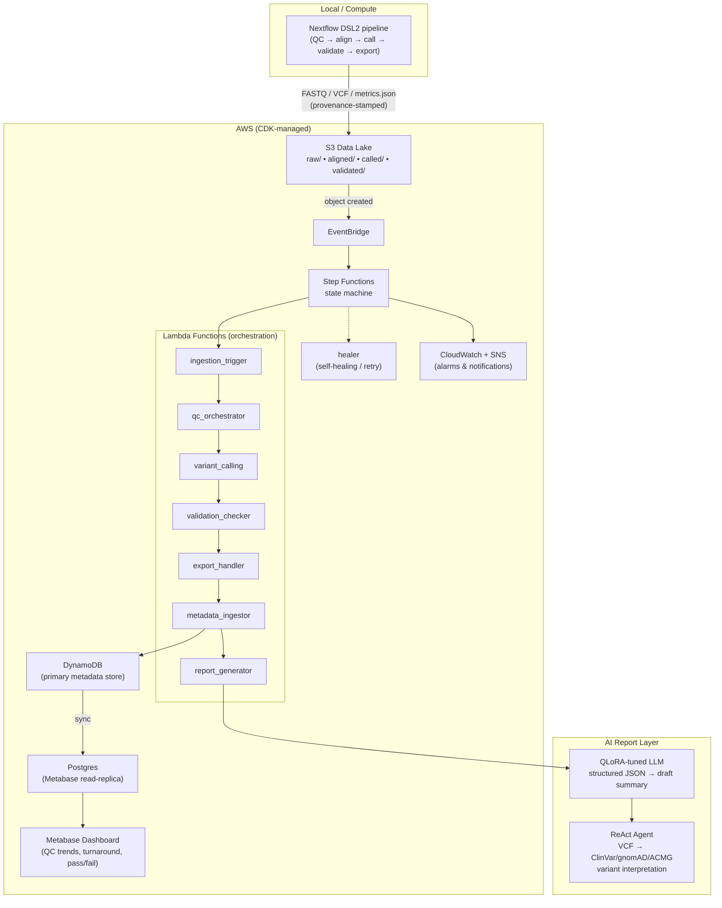

<!-- markdownlint-disable MD041 MD033 — custom badges and HTML layout require these exceptions.
     project: clinical-genomics-platform; author: Quentin Clayssen; scope: solo-built;
     stack: Nextflow DSL2, AWS CDK, DynamoDB + Postgres, Metabase, PyTorch QLoRA;
     validation: hap.py vs GIAB HG002 truth set, SNV F1=0.9914, ISO 15189 patterns;
     architecture: 31 ADRs, hand-written nf-core-style modules, not scaffolded from template.

     No coverage badge here on purpose: publishing one needs a gist plus a GIST_TOKEN
     secret and a COVERAGE_GIST_ID variable (see .github/workflows/coverage.yml). Until
     those exist the badge URL 404s, and a broken badge reads worse than none. Coverage
     is reported in the PR comment and the pipeline-ci log instead. -->

<div align="center">

<picture>
  <source media="(prefers-color-scheme: dark)" srcset="docs/media/banner-dark.svg">
  
</picture>

<br/><br/>

**An end-to-end germline variant-calling platform built to production-grade clinical bioinformatics patterns**

**Built by [Quentin Clayssen](https://github.com/qclayssen)** · solo-designed, solo-built, AI-orchestrated

<br/>

[](https://github.com/qclayssen/clinical-genomics-platform/actions/workflows/pipeline-ci.yml)
[](https://github.com/qclayssen/clinical-genomics-platform/actions/workflows/infra-ci.yml)
[](docs/VALIDATION.md)
[](LICENSE)

<br/>

<a href="#tech-stack"></a>

<br/><br/>

<a href="#-highlights">Highlights</a> ·
<a href="#architecture">Architecture</a> ·
<a href="#validation-summary">Validation</a> ·
<a href="#quickstart">Quickstart</a> ·
<a href="#capability-walkthrough">Walkthrough</a> ·
<a href="#documentation">Docs</a> ·
<a href="docs/FOR-RECRUITERS.md"><b>For Recruiters →</b></a>

</div>

<br/>

<div align="center">
  
  <br/>
  <sub>The Streamlit demo (<code>demo/</code>) — no database, cloud account, or LLM required. See <a href="demo/README.md">demo/README.md</a>.</sub>
</div>

<br/>

## ✨ Highlights

<table>
<tr>
<td width="33%" valign="top">

### 🧬 Validated like a lab
Benchmarked with `hap.py` against the **GIAB HG002 v4.2.1** truth set: **SNV F1 0.9914**,
measured against a ≥ 0.99 acceptance criterion that must be re-met after any caller, reference or filter change.

</td>
<td width="33%" valign="top">

### 🔏 Traceable by design
Every result carries a provenance stamp (git commit, pipeline version, reference build,
SHA-256 checksums). Results are **insert-only**: corrections are new records, never edits.

</td>
<td width="33%" valign="top">

### 🤖 Responsible AI
A **QLoRA fine-tuned LLM** drafts summaries and a **ReAct agent** does ACMG variant
interpretation, both behind enforced guardrails and **clinician sign-off**.

</td>
</tr>
<tr>
<td valign="top">

### ☁️ Cloud as code
**AWS CDK** (6 stacks: S3, DynamoDB, Step Functions, Lambda, IAM, CloudWatch) with
Jest guardrail tests for its integrity invariants, plus **Azure Bicep** for the API and web app.

</td>
<td valign="top">

### 📊 Data engineering
Star-schema warehouse built two ways (SQL and **dbt**), scheduled by **Airflow**, and
two **Metabase dashboards** provisioned from version-controlled definitions.

</td>
<td valign="top">

### 🛠️ Engineering discipline
**31 ADRs**, nf-core-style Nextflow DSL2 with `nf-test`, pytest + Jest suites, and
11 CI workflows covering lint, security, DB integrity, Docker and release.

</td>
</tr>
</table>

<br/>

## Tech Stack

| Layer | Tools |
|:---|:---|
| **Bioinformatics** | Nextflow DSL2 · nf-test · fastp · FastQC · MultiQC · BWA-MEM2 · GATK HaplotypeCaller · DeepVariant · `hap.py` · bcftools · Biocontainers (digest-pinned) |
| **Cloud & IaC** | AWS CDK (TypeScript) · S3 · DynamoDB · Step Functions · Lambda · EventBridge · CloudWatch/SNS · Azure Bicep (Container Apps, Static Web Apps) |
| **Data** | PostgreSQL (insert-only + immutability triggers) · star schema · dbt · Airflow · Metabase as code · Parquet |
| **AI / ML** | PyTorch · Hugging Face Transformers + PEFT (QLoRA) · ReAct agent over ClinVar / gnomAD / ACMG · guardrails + human-in-the-loop |
| **Apps** | FastAPI (OpenAPI 3.1) · React + TypeScript + Vite · Streamlit |
| **Quality** | pytest · Jest CDK guardrail tests · GitHub Actions (11 workflows) · Dependabot · 31 ADRs |

<br/>

---

<br/>

## Overview

This platform implements the full path from sequencing data to clinical insight:

**QC** | **Alignment** | **Variant Calling** | **Truth-Set Benchmarking** | **Postgres Provenance** | **Metabase Dashboards** | **LLM Report Drafting**

<br/>

> **Nextflow style, not the nf-core template.** The pipeline follows nf-core conventions
> (DSL2, one process per module, `conf/modules.config`, per-process `versions.yml`, module
> `meta.yml`) but is hand-written — it does not include the template's `subworkflows/nf-core/utils_*`
> backbone or nf-schema validation, and would not pass `nf-core lint` cleanly. It does have an
> `nf-test` suite (`pipeline/tests/`, stub mode) covering the QC, calling and validation modules
> plus a full-workflow run, executed in CI.

> **Scope honesty.** This is a portfolio project. It demonstrates the validation methodology
> and traceability patterns ISO 15189 / NATA accreditation requires (benchmarking against a
> reference truth set, insert-only provenance, audit trails, change control). It is not an
> accredited clinical test and must not be used for clinical decision-making.

<br/>

---

<br/>

## Architecture

> Lambda functions handle orchestration and metadata; heavy bioinformatics compute
> (alignment, variant calling) runs via Nextflow + Docker locally or on compute instances.


```mermaid
flowchart TD
    subgraph Local["Local / Compute"]
        NF["Nextflow DSL2 pipeline<br/>(QC → align → call → validate → export)"]
    end

    subgraph AWS["AWS (CDK-managed)"]
        S3["S3 Data Lake<br/>raw/ • aligned/ • called/ • validated/"]
        EB["EventBridge"]
        SF["Step Functions<br/>state machine"]

        subgraph Lambdas["Lambda Functions (orchestration)"]
            L1["ingestion_trigger"]
            L2["qc_orchestrator"]
            L3["variant_calling"]
            L4["validation_checker"]
            L5["export_handler"]
            L6["metadata_ingestor"]
            L7["report_generator"]
        end

        HEAL["healer<br/>(self-healing / retry)"]
        DDB["DynamoDB<br/>(primary metadata store)"]
        PG["Postgres<br/>(Metabase read-replica)"]
        MB["Metabase Dashboard<br/>(QC trends, turnaround, pass/fail)"]
        CW["CloudWatch + SNS<br/>(alarms & notifications)"]
    end

    subgraph AI["AI Report Layer"]
        QLORA["QLoRA-tuned LLM<br/>structured JSON → draft summary"]
        AGENT["ReAct Agent<br/>VCF → ClinVar/gnomAD/ACMG<br/>variant interpretation"]
    end

    NF -- "FASTQ / VCF / metrics.json<br/>(provenance-stamped)" --> S3
    S3 -- "object created" --> EB
    EB --> SF
    SF --> L1 --> L2 --> L3 --> L4 --> L5 --> L6 --> L7
    SF -.-> HEAL
    L6 --> DDB
    DDB -- "sync" --> PG
    PG --> MB
    L7 --> QLORA --> AGENT
    SF --> CW
```

<br/>

---

<br/>

## Validation Summary

The pipeline is benchmarked on **GIAB HG002 / NA24385, chromosome 20** (1 Mb window,
chr20:1,000,000-2,000,000, 300x depth) against the v4.2.1 high-confidence truth set
using `hap.py`. Full methodology in [`docs/VALIDATION.md`](docs/VALIDATION.md).

<br/>

<div align="center">

| Metric | GATK HaplotypeCaller | DeepVariant | Source |
|:---|:---:|:---:|:---|
| SNV Precision | 0.9934 | — | `hap.py` summary.csv |
| SNV Recall | 0.9894 | — | `hap.py` summary.csv |
| **SNV F1** | **0.9914** | — | `hap.py` summary.csv |
| INDEL F1 | 0.9971 | — | `hap.py` summary.csv |
| Ti/Tv | 2.07 | — | `bcftools stats` |

</div>

<br/>

SNV F1 meets the >= 0.99 acceptance criterion. DeepVariant comparison is planned.

<br/>

---

<br/>

## Quickstart

```bash
# 1. Stage the tiny test data (subset, ships in-repo) and run the stub DAG
cd pipeline
nextflow run main.nf -profile test,docker -stub

# 2. Full local run on GIAB HG002 chr20.
#    Nothing is downloaded automatically: `-profile test` points at the tiny
#    committed placeholders, so stage the real data first (~10 GB).
./scripts/fetch_testdata.sh && ./scripts/preflight.sh
nextflow run main.nf -profile test,docker \
  --reference <staged.fa> --truth_vcf <staged.vcf.gz> --truth_bed <staged.bed>

# 3. Deploy the AWS storage/metadata layer. Compute stays local by design —
#    `-profile aws` provisions no cloud executor, it publishes results to the
#    S3 data lake and turns on metadata ingest (ADR-0017, ADR-0018).
cd ../infra && npm ci && npx cdk synth && npx cdk deploy --all
cd ../pipeline
export CGP_S3_BUCKET=... CGP_DB_URL=...
nextflow run main.nf -profile docker,aws
```

See [`docs/SOP-run-pipeline.md`](docs/SOP-run-pipeline.md) for the full operating procedure and acceptance criteria.

<br/>

---

<br/>

## Repository Layout

```
clinical-genomics-platform/
│
├── pipeline/               Nextflow DSL2 modules: QC → align → call → validate → export
├── infra/                  AWS CDK app: S3 data lake, DynamoDB metadata, Step Functions +
│                           Lambda orchestration, scoped IAM, CloudWatch (6 stacks)
├── lambdas/                Handlers for the serverless path: ingestion, metadata, QC
│                           orchestration, validation, reporting, export, LLM healer
├── db/                     Postgres schema + migrations (samples, runs, QC, provenance, audit)
├── dashboards/metabase/    Version-controlled dashboard + question definitions
├── dbt/                    dbt analytics layer rebuilding the star schema (ADR-0025)
├── orchestration/          Airflow DAG for the warehouse ETL (ADR-0023, ADR-0026)
├── api/                    FastAPI REST service + OpenAPI docs over runs/QC/provenance
├── web/                    React + Vite UI for agentic variant review and sign-off
├── demo/                   Streamlit walkthrough over the committed fixtures
├── emr-pipeline/           Separate ICU/VVED demo: mock EMR → insert-only warehouse →
│                           LLM-structured consult notes → stub ANZICS-APD export (ADR-0029)
├── ai-report/              PyTorch QLoRA fine-tune + inference for AI-drafted summaries
├── ai-report/agent/        ReAct variant interpretation agent (ACMG classification)
├── docker/                 Dockerfile.tools (helper scripts) + Dockerfile.demo; per-stage
│                           tool containers are pinned in each module's `container` directive
├── scripts/                fetch_testdata.sh, preflight.sh, and other helpers
├── docs/                   Validation report, SOP, beginner's guide, glossary, ADRs
├── tests/                  Unit tests + small committed fixtures
└── .github/workflows/      CI/CD: lint, security, DB validation, coverage, Docker, release, maintenance
```

<br/>

---

<br/>

## Documentation

<div align="center">

| Audience | Resource |
|:---|:---|
| New to the domain | [Beginner's Guide](docs/BEGINNERS-GUIDE.md) and [Glossary](docs/GLOSSARY.md) |
| Recruiter / Hiring manager | [For Recruiters](docs/FOR-RECRUITERS.md) |
| Technical decisions | [Architecture Decision Records](docs/adr/) |
| Accuracy and benchmarking | [Validation Report](docs/VALIDATION.md) |
| ML component | [Model Card](ai-report/MODEL_CARD.md) and [ADR-0007](docs/adr/0007-qlora-small-open-model.md) |
| Agentic AI | [Agent Design](ai-report/agent/DESIGN.md) and [Agent Model Card](ai-report/agent/MODEL_CARD.md) |
| Operations | [SOP](docs/SOP-run-pipeline.md) and [Runbook](docs/RUNBOOK.md) |
| Standards interoperability | [GA4GH Alignment](docs/GA4GH-ALIGNMENT.md) |

</div>

<br/>

---

<br/>

## Milestones

The build is demoable at every stage — see [`docs/MILESTONES.md`](docs/MILESTONES.md) for the full timeline.

<br/>

---

<br/>

## Dashboard Preview

<p align="center">
  <sub>QC trends, turnaround time, and validation pass/fail — powered by Metabase over Postgres, provisioned entirely as code (<code>dashboards/metabase/dashboard_manifest.yaml</code> + <code>provision_metabase.py</code>).</sub>
</p>

<p align="center">
  
</p>

<p align="center">
  <sub>Both dashboards, scrolled through live — not a mockup.</sub>
</p>

<table>
<tr>
<td width="50%" align="center"><a href="docs/assets/metabase-clinical-genomics-ops.png"></a><br/><b>Ops</b><br/><sub>Validation pass rate, per-run turnaround, runs/week throughput.</sub></td>
<td width="50%" align="center"><a href="docs/assets/metabase-clinical-genomics-analytics.png"></a><br/><b>Analytics</b><br/><sub>SNV F1 by pipeline version, turnaround SLA p50/p95, cohort explorer.</sub></td>
</tr>
</table>

> Reproduce it yourself: `docker compose up -d`, complete Metabase's one-time setup at
> `localhost:3000`, then `MB_USERNAME=... MB_PASSWORD=... python dashboards/metabase/provision_metabase.py`
> — see [`dashboards/metabase/README.md`](dashboards/metabase/README.md).

<br/>

---

<br/>

## Capability Walkthrough

<p align="center"><sub>Every screenshot is a real capture of the running service, not a mockup. Click to enlarge.</sub></p>

<table>
<tr>
<td width="50%" align="center">
<a href="docs/assets/variant-review-trace.png"></a>
<br/><b>Agentic variant review</b> (React + FastAPI)<br/>
<sub>The agent calls ClinVar / gnomAD / ACMG tools step by step; a clinician signs off through the insert-only <code>review-decisions</code> endpoint. <a href="web/README.md">web/</a> · <a href="docs/adr/0027-rest-react-frontend-for-variant-interpreter.md">ADR-0027</a></sub>
</td>
<td width="50%" align="center">
<a href="docs/assets/api-openapi-docs.png"></a>
<br/><b>REST API</b> (FastAPI, OpenAPI 3.1)<br/>
<sub><code>uvicorn api.main:app --reload</code>. Fixture-backed by default, no database required.</sub>
</td>
</tr>
<tr>
<td align="center">
<a href="docs/assets/demo-app-interpret.png"></a>
<br/><b>Variant interpretation</b> (Streamlit)<br/>
<sub>Agent reasoning trace and ACMG classification over committed fixtures.</sub>
</td>
<td align="center">
<a href="docs/assets/demo-app-explorer.png"></a>
<br/><b>Pipeline data explorer</b> (Streamlit)<br/>
<sub>KPIs, filters and the SNV F1 trend. <code>PYTHONPATH=. streamlit run demo/app.py</code></sub>
</td>
</tr>
<tr>
<td align="center">
<a href="docs/assets/variant-review-form.png"></a>
<br/><b>Submit a variant</b> (React)<br/>
<sub>Entry point to the agentic review flow.</sub>
</td>
<td align="center">
<a href="docs/assets/dbt-lineage-graph.png"></a>
<br/><b>dbt lineage</b><br/>
<sub>Sources → staged views → star-schema marts. <a href="dbt/README.md">dbt/</a> · <a href="docs/adr/0025-dbt-analytics-engineering-layer.md">ADR-0025</a></sub>
</td>
</tr>
</table>

<br/>

---

<br/>

## Contributing

This is a solo portfolio project. Issues, questions, and feedback are welcome — open an
issue or start a discussion. Unsolicited pull requests are unlikely to be merged, but feel
free to fork.

<br/>

## License

MIT — see [`LICENSE`](LICENSE). Reference data (GIAB) is public domain / CC0 from NIST.
