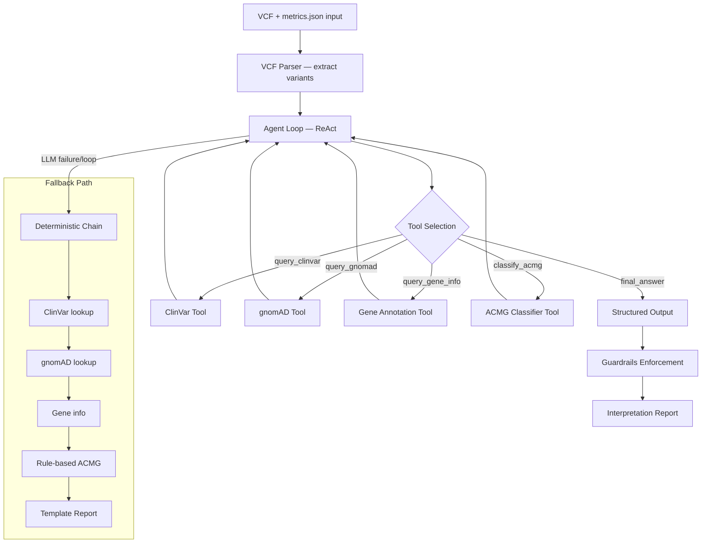

# Variant Interpretation Agent — Technical Design

## Architecture

```
┌─────────────────────────────────────────────────────────────────────┐
│                         interpret.py (CLI)                            │
├─────────────────────────────────────────────────────────────────────┤
│  VCF Parser  →  ReAct Agent  →  Report Generator  →  Output Files   │
│                      │                                               │
│                      ├─ LLM Backend (Ollama/OpenAI/Anthropic/Det.)   │
│                      ├─ Tool Registry (5 tools)                      │
│                      └─ Deterministic Fallback (on failure)          │
├─────────────────────────────────────────────────────────────────────┤
│              Knowledge Base (SQLite: ClinVar + gnomAD)               │
│              ACMG Criteria (JSON: 28 evidence codes)                 │
│              Gene Annotations (BED: chr20 genes)                     │
└─────────────────────────────────────────────────────────────────────┘
```

## Component Diagram



## Tool-Use Protocol

The agent communicates with tools via a function-calling protocol compatible with
OpenAI and Anthropic APIs:

```json
{
  "type": "function",
  "function": {
    "name": "query_clinvar",
    "description": "Look up ClinVar clinical significance for a variant",
    "parameters": {
      "type": "object",
      "properties": {
        "chrom": {"type": "string"},
        "pos": {"type": "integer"},
        "ref": {"type": "string"},
        "alt": {"type": "string"}
      },
      "required": ["chrom", "pos", "ref", "alt"]
    }
  }
}
```

## ACMG Evidence Code Mapping

| Source | Codes Derived | Logic |
|---|---|---|
| ClinVar (Pathogenic, ≥2★) | PS1, PP5 | Same AA change as established pathogenic |
| ClinVar (Pathogenic, 1★) | PP5 | Single submitter — supporting only |
| ClinVar (Benign, ≥2★) | BP6 | Reputable source reports benign |
| gnomAD AF > 5% | BA1 | Stand-alone benign |
| gnomAD AF > 1% | BS1 | Strong benign |
| gnomAD AF < 0.01% | PM2 | Absent from controls |
| gnomAD homozygotes > 0 + AF > 1% | BS2 | Observed in healthy adults |

## Safety Constraint Enforcement

Safety is enforced in **code**, not just prompts (see ADR-0008):

1. **Treatment language scrubbing** (`enforce_safety_constraints()`): Regex-based detection
   and replacement of treatment/diagnosis language with `[REVIEW REQUIRED]`.
2. **Mandatory banner**: `AI-DRAFTED VARIANT INTERPRETATION — REQUIRES CLINICAL GENETICIST REVIEW`
   — inserted programmatically in every report, cannot be omitted.
3. **VUS uncertainty flag**: Every VUS classification automatically receives a mandatory
   uncertainty statement requiring manual review.
4. **Evidence requirement**: `final_answer` tool validates that evidence codes are non-empty.
5. **Guardrail validation**: `enforce_report_guardrails()` checks all constraints and
   returns violations — used in CI to catch regressions.

## Failure Modes and Fallback Behavior

| Failure Mode | Detection | Recovery |
|---|---|---|
| LLM unavailable | `ConnectionError` from backend | Fall through to deterministic |
| LLM loops (same tool+args) | Call history tracking | Trigger fallback |
| Max iterations exceeded | Counter in ReAct loop | Trigger fallback |
| Token budget exhausted | Running token count | Trigger fallback |
| Invalid tool call | Tool not found error | Return error observation to LLM |
| LLM returns no tool calls | Missing `final_answer` | Trigger fallback |

## Evaluation Methodology

Classification accuracy is measured against the local knowledge base ground truth:

- **Known Pathogenic variants** (PRNP E200K, JAG1 R468*, etc.): Should classify as
  Pathogenic or Likely Pathogenic.
- **Known Benign variants** (PRNP M129V, AURKA F31I): Should classify as Benign.
- **VUS variants** (CDH22 A238T): Should classify as Uncertain Significance.

Property-based tests verify universal invariants (BA1 → Benign, agent termination, etc.)
across 200+ generated examples per property.

## File Layout

```
ai-report/agent/
├── __init__.py           # Package init, version
├── interpret.py          # CLI entry point
├── react.py              # ReAct agent loop + Variant/TraceStep/InterpretationResult
├── deterministic.py      # No-LLM fallback path
├── llm.py                # Multi-provider LLM abstraction
├── tools.py              # Tool definitions + ToolRegistry
├── vcf_parser.py         # VCF parsing + gene annotation
├── report.py             # Report generation + guardrails
├── trace.py              # Observability + provenance + audit
├── prompts/
│   └── system.md         # Agent system prompt
├── data/
│   ├── chr20_knowledge.db    # SQLite: ClinVar + gnomAD
│   ├── acmg_criteria.json    # 28 ACMG evidence codes
│   ├── chr20_genes.bed       # Gene coordinates
│   └── knowledge_base.py     # Data access layer
├── DESIGN.md             # This file
└── MODEL_CARD.md         # Agent model card
```
