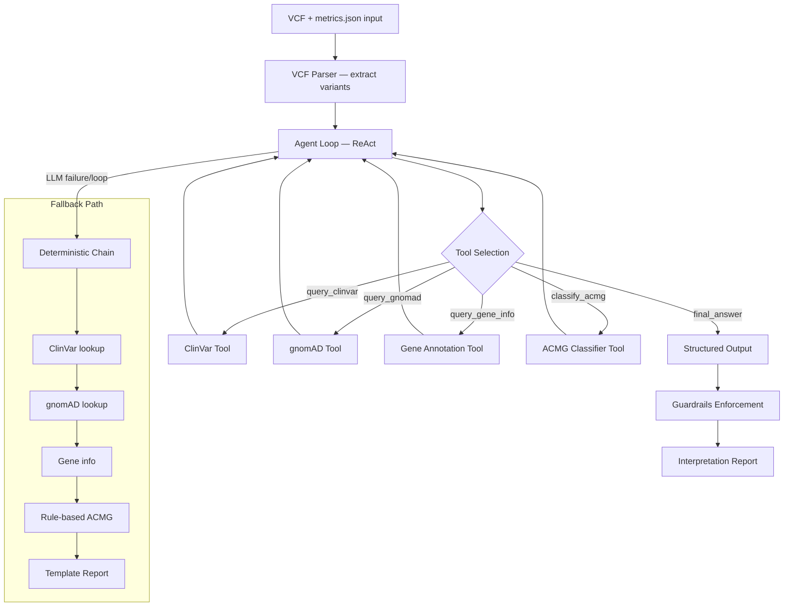

# Variant Interpretation Agent — Technical Design

## Architecture

```
┌─────────────────────────────────────────────────────────────────────┐
│  interpret.py (CLI)  │  api/routers/agent.py (REST)  │  Streamlit    │
│       VCF input      │   discrete fields OR FHIR      │   demo page  │
├─────────────────────────────────────────────────────────────────────┤
│  Input  →  ReAct Agent  →  Report Generator  →  Output/Response     │
│                      │                                               │
│                      ├─ LLM Backend (Ollama/OpenAI/Anthropic/        │
│                      │   Azure AI Foundry/AWS Bedrock/Det.)          │
│                      ├─ Tool Registry (5 tools)                      │
│                      └─ Deterministic Fallback (on failure)          │
├─────────────────────────────────────────────────────────────────────┤
│              Knowledge Base (SQLite: ClinVar + gnomAD)               │
│              ACMG Criteria (JSON: 28 evidence codes)                 │
│              Gene Annotations (BED: chr20 genes)                     │
│              FHIR Intake (fhir_intake.py — Observation → Variant)    │
└─────────────────────────────────────────────────────────────────────┘
```

Three entry points share the same `ReActAgent`/`DeterministicInterpreter` core: the CLI
(batch, VCF-file oriented), the REST API (`api/routers/agent.py` — single-variant, discrete
fields or a FHIR `Observation`, see ADR-0027/ADR-0028), and the Streamlit demo page. None of
them re-implement the agent — they're all thin callers into this package.

## Component Diagram


```mermaid
graph TD
    A[VCF + metrics.json input] --> B[VCF Parser — extract variants]
    B --> C[Agent Loop — ReAct]
    C --> D{Tool Selection}
    D -->|query_clinvar| E[ClinVar Tool]
    D -->|query_gnomad| F[gnomAD Tool]
    D -->|query_gene_info| G[Gene Annotation Tool]
    D -->|classify_acmg| H[ACMG Classifier Tool]
    D -->|final_answer| I[Structured Output]
    E --> C
    F --> C
    G --> C
    H --> C
    I --> J[Guardrails Enforcement]
    J --> K[Interpretation Report]

    subgraph "Fallback Path"
        L[Deterministic Chain] --> E2[ClinVar lookup]
        E2 --> F2[gnomAD lookup]
        F2 --> G2[Gene info]
        G2 --> H2[Rule-based ACMG]
        H2 --> I2[Template Report]
    end

    C -->|LLM failure/loop| L
```

## Tool-Use Protocol

The agent communicates with tools via a function-calling protocol compatible with
OpenAI and Anthropic APIs:

```json
{
  "type": "function",
  "function": {
    "name": "query_clinvar",
    "description": "Look up ClinVar clinical significance for a variant",
    "parameters": {
      "type": "object",
      "properties": {
        "chrom": {"type": "string"},
        "pos": {"type": "integer"},
        "ref": {"type": "string"},
        "alt": {"type": "string"}
      },
      "required": ["chrom", "pos", "ref", "alt"]
    }
  }
}
```

## ACMG Evidence Code Mapping

| Source | Codes Derived | Logic |
|---|---|---|
| ClinVar (Pathogenic, ≥2★) | PS1, PP5 | Same AA change as established pathogenic |
| ClinVar (Pathogenic, 1★) | PP5 | Single submitter — supporting only |
| ClinVar (Benign, ≥2★) | BP6 | Reputable source reports benign |
| gnomAD AF > 5% | BA1 | Stand-alone benign |
| gnomAD AF > 1% | BS1 | Strong benign |
| gnomAD AF < 0.01% | PM2 | Absent from controls |
| gnomAD homozygotes > 0 + AF > 1% | BS2 | Observed in healthy adults |

## Safety Constraint Enforcement

Safety is enforced in **code**, not just prompts (see ADR-0008):

1. **Treatment language scrubbing** (`enforce_safety_constraints()`): Regex-based detection
   and replacement of treatment/diagnosis language with `[REVIEW REQUIRED]`.
2. **Mandatory banner**: `AI-DRAFTED VARIANT INTERPRETATION — REQUIRES CLINICAL GENETICIST REVIEW`
   — inserted programmatically in every report, cannot be omitted.
3. **VUS uncertainty flag**: Every VUS classification automatically receives a mandatory
   uncertainty statement requiring manual review.
4. **Evidence requirement**: `final_answer` tool validates that evidence codes are non-empty.
5. **Guardrail validation**: `enforce_report_guardrails()` checks all constraints and
   returns violations — used in CI to catch regressions.

## Failure Modes and Fallback Behavior

| Failure Mode | Detection | Recovery |
|---|---|---|
| LLM unavailable | `ConnectionError` from backend | Fall through to deterministic |
| LLM loops (same tool+args) | Call history tracking | Trigger fallback |
| Max iterations exceeded | Counter in ReAct loop | Trigger fallback |
| Token budget exhausted | Running token count | Trigger fallback |
| Invalid tool call | Tool not found error | Return error observation to LLM |
| LLM returns no tool calls | Missing `final_answer` | Trigger fallback |

## Evaluation Methodology

Classification accuracy is measured against the local knowledge base ground truth:

- **Known Pathogenic variants** (PRNP E200K, JAG1 R468*, etc.): Should classify as
  Pathogenic or Likely Pathogenic.
- **Known Benign variants** (PRNP M129V, AURKA F31I): Should classify as Benign.
- **VUS variants** (CDH22 A238T): Should classify as Uncertain Significance.

Property-based tests verify universal invariants (BA1 → Benign, agent termination, etc.)
across 200+ generated examples per property.

## Observability: tokens, latency, cost (AI-8, ADR-0036)

The existing trace is extended, not duplicated. Every LLM call in the ReAct loop produces an
`LLMCallRecord` (`observability.py`) on `InterpretationResult.llm_calls`, carried into
`AgentTrace`/`RunTrace` and the REST response (`llm_calls`, `llm_usage`):

| Field | Source | When unknown |
|---|---|---|
| `backend`, `model_id` | the backend that answered (read after the call, so `FallbackLLM` reports the real one) | — |
| `prompt_tokens`, `completion_tokens` | the provider's usage block (`LLMResponse.usage`) | `None`, never 0 or a tokenizer guess |
| `latency_ms` | wall-clock around `backend.generate()` | always measured, including failed calls |
| `estimated_cost_usd` | `PRICE_TABLE` (list prices, dated `PRICE_TABLE_AS_OF`) × tokens | `None` for unknown models or missing usage; 0.0 for local backends |
| `trace_step_index` | index of the first `TraceStep` that call produced | `None` |

Aggregates (`summarize_calls`) sum only calls that reported usage and expose
`n_calls_without_usage`. The aggregate cost is `None` if any call's cost is unknown, because a
partial sum would look complete. When the route or CLI falls back to the deterministic
interpreter, the agent's `llm_calls` are kept on the returned result: those calls happened and
cost tokens.

**Persistence.** `POST /agent/variant-review` writes one row per interpretation to the
insert-only `agent_call_metrics` table (`db/migrations/0002_agent_call_metrics.sql`, also in
`db/schema.sql`, protected by `forbid_mutation()`), and Metabase card 11 plots it. A failed
metrics write is logged and never fails the interpretation.

**OpenTelemetry (optional).** Set `AGENT_OTEL_ENABLED=1` and install `opentelemetry-api` plus an
SDK/exporter to get spans `agent.run` → `agent.llm_call` / `agent.tool_call`. If the variable is
unset or the package is missing, spans are no-ops. Span attributes pass an allow-list
(`_ALLOWED_SPAN_ATTRS`).

**What is never logged.** Call records, span attributes and `agent_call_metrics` rows hold
**counts, ids and timings only**: no prompt or completion text, no tool arguments, no variant
coordinates or other PHI. This is the default, and there is no flag to turn it off. The
reasoning trace (`TraceStep.content`) is unchanged and still returned to the reviewer, because
clinical sign-off needs it. It is not exported to OTel or the metrics table.

## File Layout

```
ai-report/agent/
├── __init__.py           # Package init, version
├── interpret.py          # CLI entry point
├── react.py              # ReAct agent loop + Variant/TraceStep/InterpretationResult
├── deterministic.py      # No-LLM fallback path
├── llm.py                # Multi-provider LLM abstraction (Ollama/OpenAI/Anthropic/Azure/Bedrock)
├── fhir_intake.py        # Minimal HL7 FHIR genomics Observation → Variant mapping
├── tools.py              # Tool definitions + ToolRegistry
├── vcf_parser.py         # VCF parsing + gene annotation
├── report.py             # Report generation + guardrails
├── trace.py              # Observability + provenance + audit
├── observability.py      # Per-LLM-call tokens/latency/cost, price table, optional OTel spans
├── prompts/
│   └── system.md         # Agent system prompt
├── data/
│   ├── chr20_knowledge.db    # SQLite: ClinVar + gnomAD
│   ├── acmg_criteria.json    # 28 ACMG evidence codes
│   ├── chr20_genes.bed       # Gene coordinates
│   └── knowledge_base.py     # Data access layer
├── DESIGN.md             # This file
└── MODEL_CARD.md         # Agent model card
```
