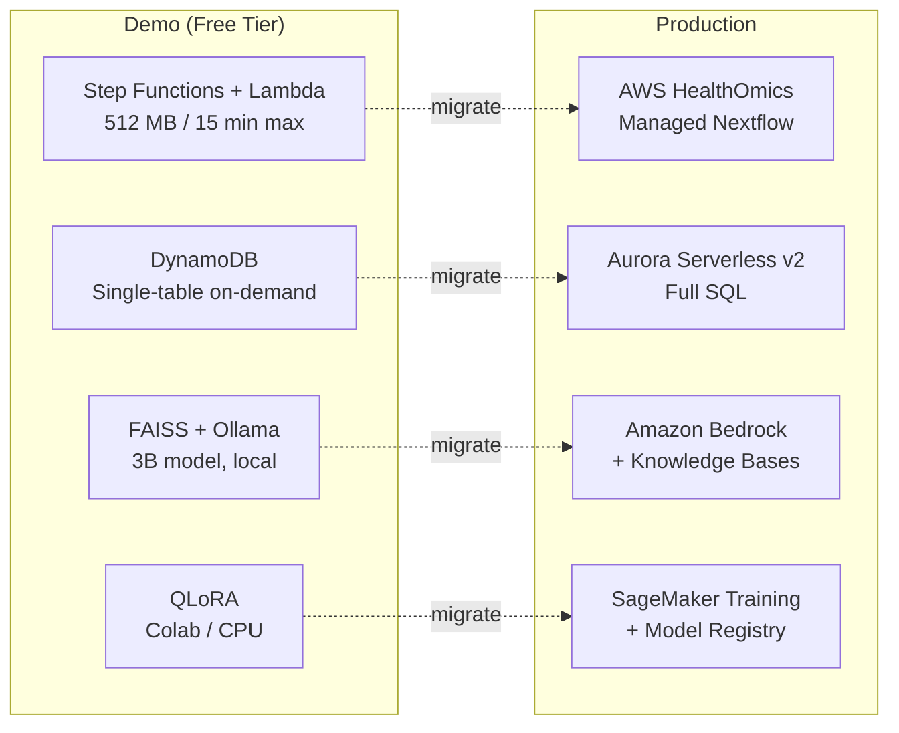

# Production Migration Path

## Introduction

This platform uses AWS free-tier and local-first components to demonstrate clinical
genomics patterns at zero cost. Every architectural choice maps to a production-grade
AWS service. This document describes those migration paths and their trade-offs.

## Architecture Comparison

## Migration Paths

### 1. Pipeline Execution: Lambda to AWS HealthOmics

**Current:** Lambda orchestrators (512 MB, 15-min timeout) invoke pipeline stages via Step Functions. Nextflow runs locally with stub mode for CI.

**Production:** AWS HealthOmics private workflows provide a managed Nextflow runtime for genomics. The existing `main.nf` and all 12 modules upload directly — HealthOmics natively executes Nextflow DSL2. Container directives already reference Biocontainers images; no changes needed.

**Benefits:** No timeout constraints, automatic compute scaling, per-run pricing, native Nextflow `resume`, HIPAA-eligible.

### 2. Data Store: DynamoDB to Aurora Serverless v2

**Current:** DynamoDB single-table design (PK: `run_id`, SK: `record_type`) with on-demand billing. Handles key-value access patterns at demo scale.

**Production:** Aurora Serverless v2 (PostgreSQL-compatible) when queries need JOINs, aggregations, or complex analytics. The existing `db/schema.sql` defines the relational model — Aurora adopts it directly. Append-only patterns translate to `REVOKE DELETE, UPDATE` grants.

**Benefits:** Full SQL with JOINs and CTEs, native Metabase/QuickSight connectivity, serverless scaling to zero ACUs, 35-day point-in-time recovery.

### 3. AI Reporting: Local RAG to Amazon Bedrock + Knowledge Bases

**Current:** FAISS vector store over ClinVar/ClinGen annotations with Ollama serving a quantized 3B model. Custom `enforce_guardrails()` applies review banner, provenance, and clinical-phrase scrubbing.

**Production:** Bedrock Knowledge Bases manages RAG (auto-chunking, Titan embeddings, vector indexing). Claude or Titan handles generation. Guardrails migration:

| Demo Guardrail | Bedrock Guardrails API Equivalent |
|---|---|
| `AI-DRAFTED` banner | Content policy with mandatory prefix |
| Clinical phrase scrubbing | Denied topics configuration |
| Provenance citation | Grounding policy with source attribution |

**Benefits:** Managed embeddings, frontier model access (Claude 3.5), auditable safety policies, SOC 2 / HIPAA BAA eligible.

### 4. Fine-Tuning: Local QLoRA to SageMaker Training + Model Registry

**Current:** QLoRA fine-tuning of a 3B model on free compute. `train_smoke.py` validates the loop in CI. Adapter weights saved in PEFT format.

**Production:** SageMaker Training Jobs with managed spot instances (`ml.g5.xlarge`, up to 70% cost reduction). SageMaker Model Registry provides versioning, approval workflows, and lineage tracking. The existing `train_lora.py` packages directly as a training job entry point.

**Benefits:** Automatic checkpointing, spot recovery, hyperparameter tuning, training metrics in CloudWatch.

## Cost and Operational Trade-offs

| Component | Demo (Free Tier) | Production Service | Monthly Cost | Key Trade-off |
|---|---|---|---|---|
| Pipeline | Lambda + SFN ($0) | HealthOmics | $50-500 | 15-min timeout vs. unlimited managed runtime |
| Data Store | DynamoDB ($0) | Aurora Serverless v2 | $30-200 | Key-value only vs. full SQL |
| AI Reports | FAISS + Ollama ($0) | Bedrock + KB | $10-100 | Manual maintenance vs. managed RAG |
| Fine-Tuning | Local/Colab ($0) | SageMaker | $5-50/run | Free but manual vs. managed spot + registry |

**Demo total:** $0/month | **Production estimate:** $95-850/month depending on volume

## Migration Steps (High-Level)

1. **Data layer:** Provision Aurora Serverless v2, enable DynamoDB Streams, backfill, validate parity
2. **Pipeline:** Create HealthOmics private workflow from `main.nf`, update Step Functions to call `StartRun`
3. **AI reporting:** Create Bedrock Knowledge Base, configure Guardrails API, replace Ollama calls
4. **Fine-tuning:** Package `train_lora.py` as SageMaker job, register adapter in Model Registry

Each component migrates independently — the modular CDK stack architecture (separate stacks for data lake, orchestration, metadata, IAM) ensures no coupling between migration phases.

## Conclusion

The demo proves correctness: provenance tracking, append-only audit trails, guardrailed AI, and validated variant calling all work end-to-end. Each free-tier component was chosen with its production counterpart in mind — Lambda proves the workflow logic HealthOmics will scale, DynamoDB proves the data model Aurora will query, local RAG proves the pattern Bedrock will manage, and QLoRA smoke tests prove the loop SageMaker will run on real GPUs.
